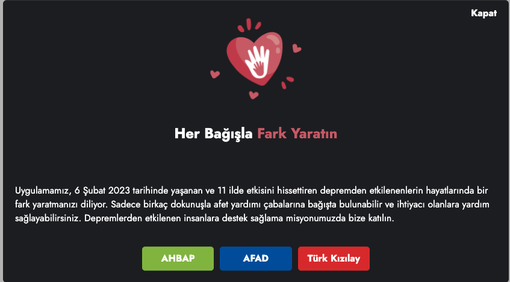
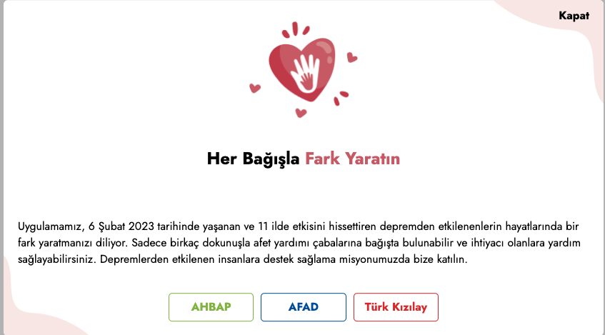

# DONATE.JS

Donate.js WEB SDK to show donation alerts easily in your website.

## Examples

<p align="center">
  
  
</p>

## Installation

```
npm install
```

## Development mode

```
npm run dev
```

## Production mode

You can include the javascript and css file created in the dist folder in your project.

```
npm run build
```

## Usage

### Default initializer

DONATE.JS can be initialized through, which has default title and message those are presented in the screenshot above.
theme : dark or light
position : center or top

```js
  <link rel="stylesheet" href=".donate.min.css" />
  <script src="./donate.min.js"></script>
    <script>
    const donate = new Donate({
      position:"center",
      theme:"light"
      title:"Sample Title",
      highLight:"Sample HighLight Title"
      links: [
          {
            text: "Örnek Bağış Linki",
            url: "https://www.google.com",
          },
        ],
      message:"Sample Message",
    })
    donate.init();
    </script>
```
