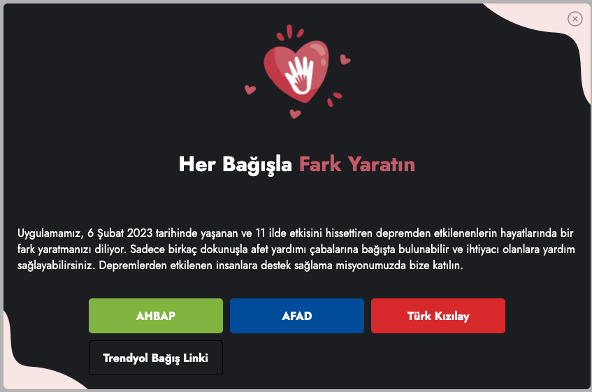
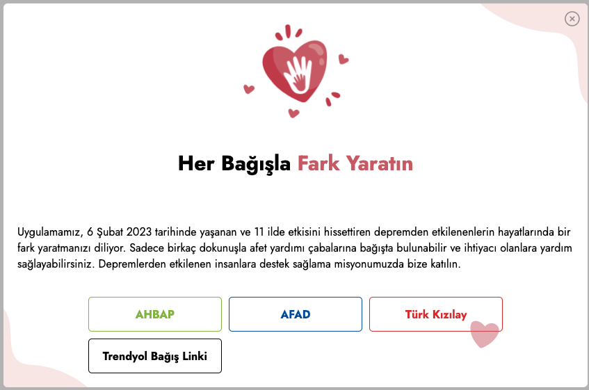

# DONATE.JS

Donate.js WEB SDK to show donation alerts easily in your website.

## Examples

<p align="center">
  
  
</p>

## Installation

```
https://github.com/mobven/donate.js.git
```

## Usage

### Default initializer

DONATE.JS can be initialized through, which has default title and message those are presented in the screenshot above.

```js
  <link rel="stylesheet" href="./assets/css/style.css" />
  <script src="./donate.js></script>
    <script>
    const donate = new Donate({
      position:"center",
      links: [
          {
            text: "Örnek Bağış Linki",
            url: "https://www.google.com",
          },
        ],
      message:"Sample Message",
    })
    donate.init();
    </script>
```
